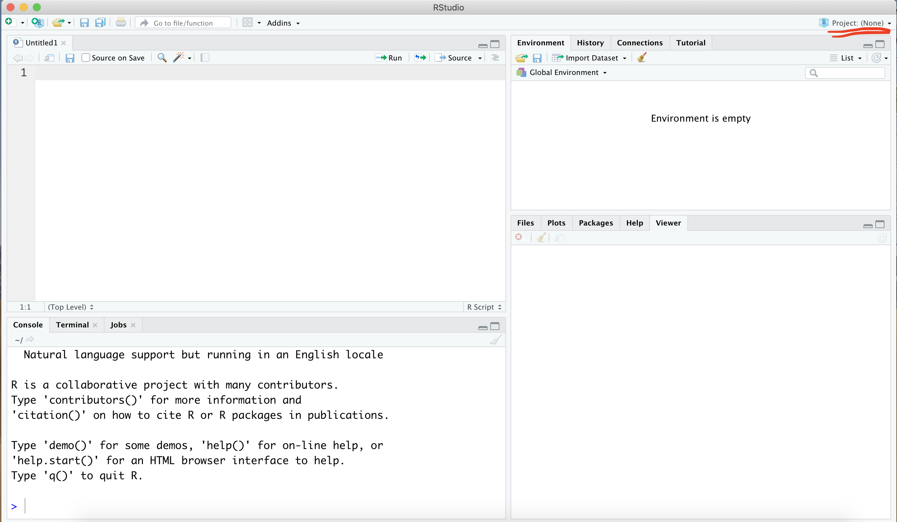
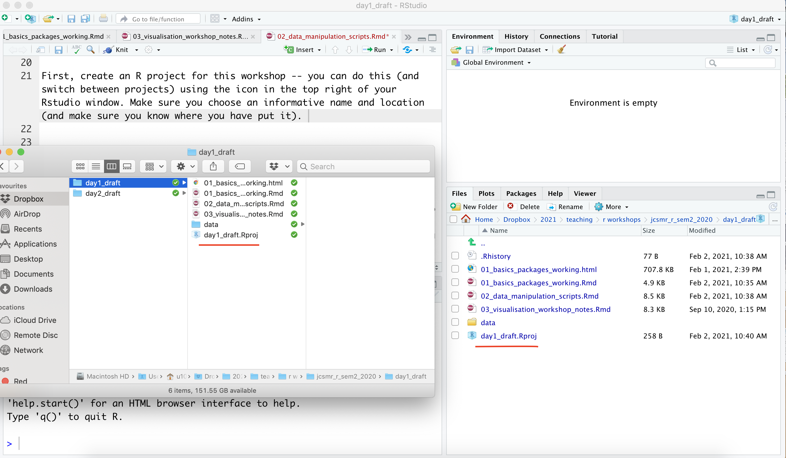
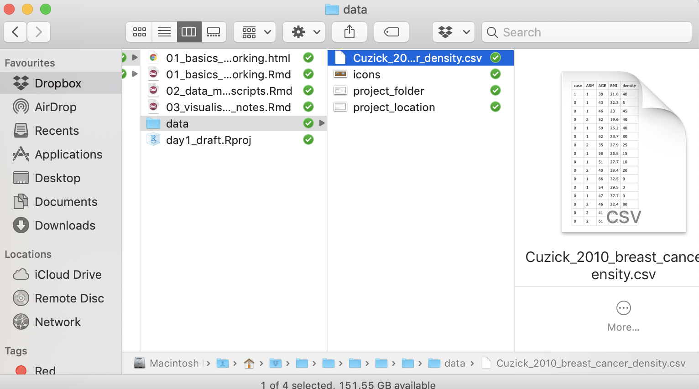
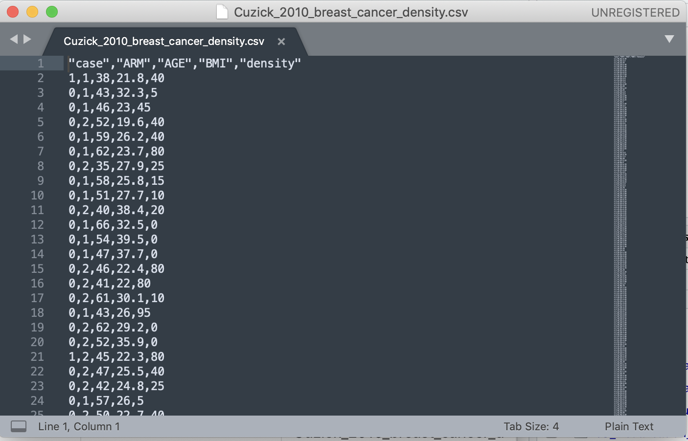
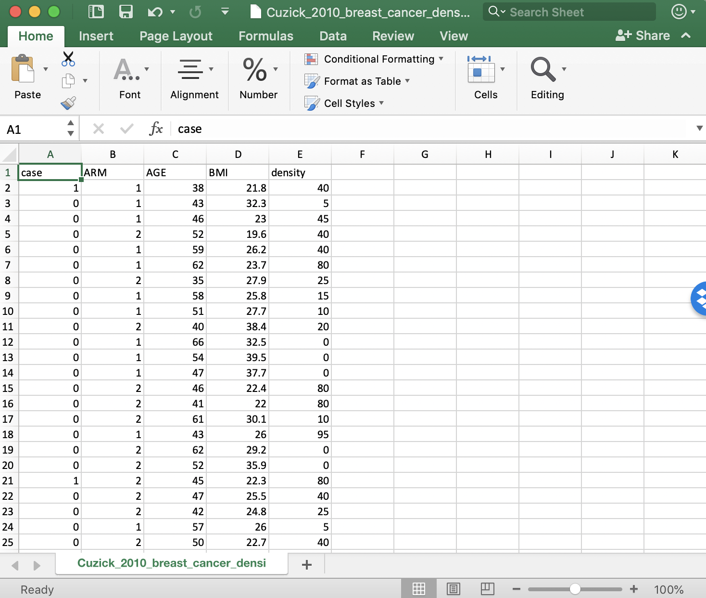

```{r setup, include=FALSE}
#Don't edit this
knitr::opts_chunk$set(echo = TRUE)
```

The goal of this workshop is to encourage you to be comfortable getting your data into R and using it for your basic data visualisations, summaries, etc.. Going forward, you will expand on these skills, learn some more complex techniques, and produce a statistical workflow for your data. But for the moment, you just need to feel ok about setting up a project, getting your data into R, and looking at it. This is the first and perhaps most important step of any statistical analysis. Further, having your work in R helps you keep a record of what you have done and helps us help you at the data analysis workshops and drop-in sessions.

# Working with data

The strength of R over other languages is that it is built to handle data. We will start by looking at some data from the following paper:

Cuzick, J., Warwick, J., Pinney, E., Duffy, S. W., Cawthorn, S., Howell, A., ... & Warren, R. M. (2011). Tamoxifen-induced reduction in mammographic density and breast cancer risk reduction: a nested case–control study. Journal of the National Cancer Institute, 103(9), 744-752.

First, **create an Rstudio project for this workshop** -- you can do this (and switch between projects) using the icon in the top right of your Rstudio window. Make sure you choose an informative name and location (and make sure you know where you have put it). 

```{r echo = FALSE}

```

If you open that location using your finder / windows explorer you'll see that the Rstudio project is just a folder with a .Rproj file inside -- you can create subfolders (like 'data' shown here), copy and paste files, etc. as you normally would. 

```{r echo = FALSE}

```

I will provide you with a data file over dropbox or similar. Download it, create a 'data' folder in your project, and put the file there.

```{r echo = FALSE}

```

This data is formatted as a '.csv', which stands for 'comma separated values' -- it is just a spreadsheet. Before looking at it in R, we can look at it in a text editor or in excel.

```{r echo = FALSE}


```

It is a single spreadsheet with no formatting -- each line is a row, and columns are separated by commas. More specifically, each row represents a patient, and the columns are the relevant measurements/observations/variables. Note that the data starts in the top left, and has a single 'header' row with the names of the columns. This is the ideal way to set up your data for analysis. We will talk a little more about spreadsheets next time.

## Reading in data

We will jump straight in to looking at the data in R. First, you need to load the 'tidyverse' library (you may need to install it if you haven't).

```{r}
#install.packages(tidyverse)
library(tidyverse)
```

Then, we read in the data using the read_csv() function, and assign it to the variable with the name cancer_df. Note:
- when you create the file name (with '') you can use tab to autocomplete it and avoid spelling mistakes etc.
- the name of the file should appear green in rstudio, the other R code should stay black.
- '<-' means 'is', so you might read this line of code as 'cancer_df is the output of read_csv() of/with the file "data/....csv"'
-
```{r}
cancer_df <- read_csv('data/Cuzick_2010_breast_cancer_density.csv')
```


The first thing I would do after reading in a file is look at it.

```{r}
cancer_df
```

A more informative/readable thing to look at is from the function str() or glimpse().  

```{r}
glimpse(cancer_df)
```

It is important to check that the data are what you expect, i.e., columns that you expect to be numbers are represented that way. Read through each line of the str ouput (i.e., each column of the data) and think about what it is, what the values are, etc..

Another useful thing to look at is the summary of a data frame, or the head (i.e., the first few rows).

```{r}
summary(cancer_df)

head(cancer_df)
```

## The gtsummary package

The gtsummary package offers formatted tables to get a quick summaries of the data. The default summary statistics are median (IQR) for numerical data and n(%) for categorical data. You can change these defaults as you wish. 
Here are a few examples:

```{r}
library(gtsummary)

cancer_df %>%
  tbl_summary()
```

In this example, there are two treatment groups. We can summarise characteristics by treatment group.
```{r}
cancer_df %>%
  tbl_summary(by = ARM) %>%
  add_overall(last = TRUE)
```

Often our data has many columns and we only wish to summarise a few of them. The select() function in dplyr package (part of tidyverse) allows us to select the columns we want to summarise.

```{r}
cancer_df %>%
  select(ARM, AGE, BMI) %>%
  tbl_summary(by = ARM) %>%
  add_overall(last = TRUE)
```

## Getting help with R

You aren't alone in your R journey. You should always expect to make use of the experience of those around you, this includes:

- the other participants in this workshop or people around you: often getting a second opinion from a friend can help solve a problem.
- local experts -- e.g., you could attend the drop in sessions which run each Tuesday at 10am (see https://bdsi.anu.edu.au/training-courses/bdsi-bioinformatics-and-statistics-drop-ssssions), or email me and I'm happy to try to help.
- internet resources -- there are formal resources like the cheat sheet, free online textbooks (a great starting point is R for Data Science https://r4ds.had.co.nz/), or you can almost always search google for your problem or an error message you have seen

The most useful thing you can do to make your life easier is to practice. If you don't use R for a few months, you will likely forget and you will have to refresh, whereas the more often you practice the less likely to are to forget and the easier life will be.


